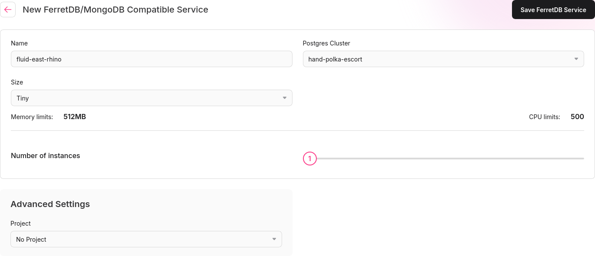

FerretDB is a document-oriented database that provides a MongoDB-compatible API.
It is built on top of PostgreSQL and offers a truely open-source alternative to
MongoDB.

## Installing FerretDB

To get started with FerretDB:

1. Navigate to the `Databases` section in the control server.
2. Click `Manage Batteries`.
3. Find the `FerretDB` battery and click `Install`.

FerretDB also depends on the postgres battery, which is installed automatically when first starting the control server.

## Creating a FerretDB instance

To create a new FerretDB instance:

1. Go to the `Databases` tab
2. [Ensure that there is a postgres instance](/docs/postgres) running
3. Click `New FerretDB` in the FerretDB section
4. Fill out the form with the desired settings, choosing the postgres instance to use, along with memory and CPU limits
5. Click `Save FerretDB` to finalize creation.

## Accessing FerretDB

After creating a FerretDB instance, there will be a service created in the `battery-data` namespace with the name of the ferretdb instance.
