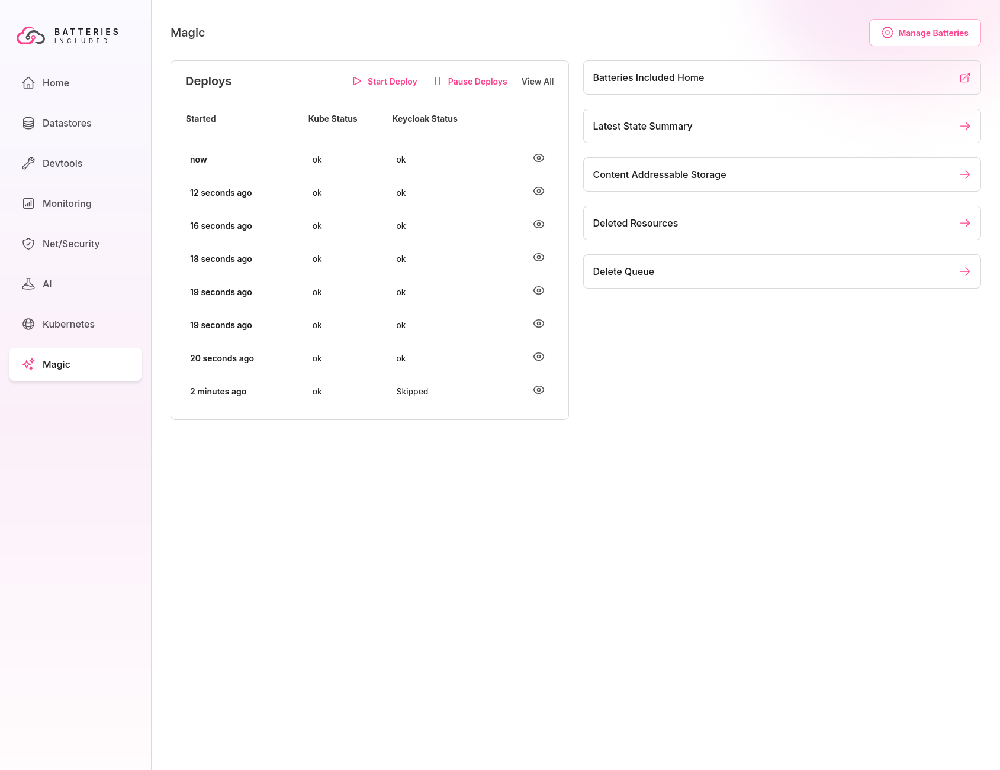

Engineers often assume that consistency in software-defined infrastructure
solves all ills simply by providing default settings or code templates. While
offering the correct defaults or templates, such as those for
[Helm](https://helm.sh/docs/chart_best_practices/templates/) or
[Terraform](https://spacelift.io/blog/terraform-templates), may seem sufficient
to ensure long-term reliability and consistency, experience has shown that this
approach is insufficient to maintain software development velocity and system
reliability over time. This article will explore the challenges of using Helm
templates and how Batteries Included's automation and UI effectively address
these issues.

## Empowered Ownership and Avoiding Drift

The best, most usable, most effective software is created by teams of engineers
who are given the freedom to develop systems aligned with their vision. This
means cultivating a culture of ownership throughout the organization. However,
just handing out templates to developers for provisioning databases, caches, or
stream processing systems undermines this sense of ownership.  
This is a hurdle you need to overcome. Any changes to production code affecting
infrastructure may require manual intervention. Developers unfamiliar with YAML
or Terraform will likely need help to make these changes independently,
resulting in delays and potential errors.  
In this scenario, the infrastructure team can feel like a "parent" whose
well-intentioned advice goes unheeded or fails to perform as expected in
practice.  
Ownership is not the only challenge—code is a living entity that evolves
constantly, and development teams need to be able to adapt to that evolution.
When different teams make isolated changes, the infrastructure can drift,
becoming unstable and brittle over time.

## A Tale of Two Teams

Consider a fictional company where the infrastructure team provides PostgreSQL
Terraform templates to two internal groups: Team Foo and Team Bar. Initially,
both teams start with the same values and defaults, and everything works
seamlessly, with monitoring and standardization in place.  
Team Foo's service experiences significant growth as time passes, requiring
infrastructure expansion and configuration changes for newly provisioned VMs or
hardware. Meanwhile, Team Bar's service sees less traffic and remains
essentially unchanged.  
Then, when a new version of PostgreSQL is released, the infrastructure team
requests that all teams upgrade to the latest version, offering recommendations
such as:

- A 5% increase in memory allocation for the containers
- An additional CPU core for improved compression
- Reduced storage due to improved auto vacuuming

However, these infrastructure updates are no longer applicable since both teams'
Terraform configurations have diverged. Having modified their setup for new
hardware, Team Foo may encounter issues like memory overconsumption, leading to
conflicts with the Linux OOM killer. At the same time, Team Bar may see no
problems on their end.  
Developers from either team, especially those without deep infrastructure
expertise, will likely need help diagnosing and solving these issues. A typical
short-term solution might be to disable specific metrics or monitoring, which
could temporarily resolve the memory issue but exacerbate the problem of
infrastructure drift.

## Solving the Problem

To address these challenges, it is essential to:

- **Ensure infrastructure changes are always safe.** Automate all changes to
  check for safety and prevent edits that could lead to instability.
- **Make the correct changes more straightforward to implement than suboptimal
  ones.** Provide tools that effortlessly guide teams toward optimal
  configurations.
- **Ensure that teams with the appropriate expertise handle infrastructure
  deployments.** Avoid placing the burden of infrastructure management, such as
  deploying and troubleshooting PostgreSQL, on developers who specialize in
  unrelated areas.
- **Ensure that all infrastructure changes are made via tested and safe
  automation.** To guarantee safe changes, you need deep insight into metrics,
  traffic flows, and network architecture. Applying changes via GitOps with some
  validation can still lead to critical issues in production environments.

Batteries Included's solution enables infrastructure consistency without
sacrificing the autonomy and ownership crucial for engineering teams to succeed
by focusing on automation, safety checks, and empowering teams with the right
tools.

### Sneak Preview

Here's a screenshot of our up coming public beta _Batteries Included_ platform
as it deploys changes to Kubernetes and Keycloak repeatably and safely. We've
taken all the insights here and more building them into the platform's
automation.

