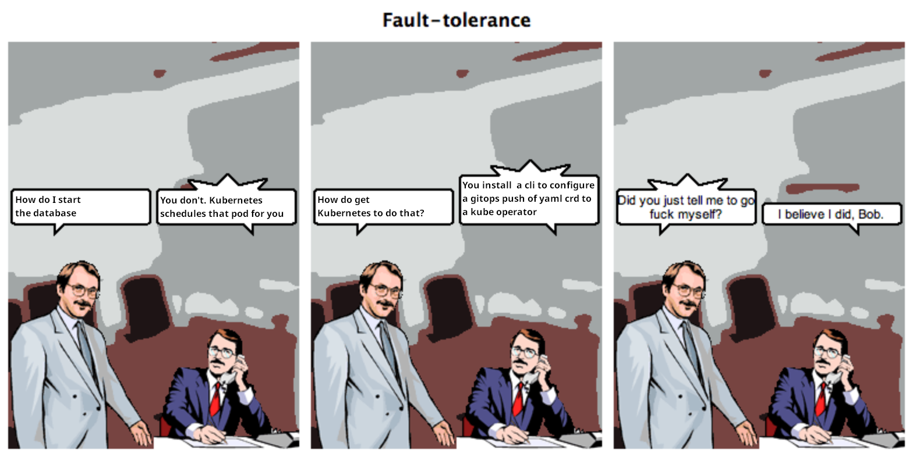

## Introduction: The Power of Open-Source Systems

In today's rapidly evolving software landscape, open-source systems have emerged
as the gold standard for interface layers in software platform technology. But
why? This article delves deep into the reasons, presenting a compelling case for
their adoption. From the outset, let's establish a strong thesis: Open-source
systems are not just an option but the optimal choice for any forward-thinking
software platform.

## The Open-Source Advantage: No More Vendor Lock-In

Open-source services have a distinct edge: they significantly reduce vendor
lock-in. Open-source services offer a clear advantage: they dramatically
minimize vendor dependency. With infrastructure under permissive licenses like
Apache 2, MIT, and BSD, businesses can move their systems to any hardware
vendor, both now and in the future. This flexibility ensures you're not confined
to a specific library or language, allowing you to make informed decisions
without the looming threat of unexpected price hikes.

## Kubernetes: The Ideal Base Layer

Despite its inherent complexity, Kubernetes is the perfect base layer for
building platforms. While it might seem intricate and overly complex, the
open-source software on Kubernetes is nothing short of revolutionary. We harness
this power at Batteries Included, ensuring the complexity magically fades away.
Of course, it's not actual magic—it's the result of tireless efforts from the
best infrastructure team in the business. You can always look inside the Magic
tab of the Batteries Included platform to see the tools and automation that make
simplicity possible.

### Kubernetes and Service Level Indicators

Kubernetes shines in its provision of easy service level indicators (SLIs).
These SLIs pave the way for swift and precise automation. At Batteries Included,
we harness these SLIs to craft automated remediations and machine
learning-driven configurations. The result? Product engineers enjoy rapid
business development times, armed with sophisticated and user-friendly tools.

## The Cost/Time/Value Dilemma

The software industry often recommends systems that, while powerful, come with a
steep learning curve. The time and resources required to integrate these systems
often make the cost/time/value trade-off unappealing. Take, for instance, the
documentation for
[Keycloak's REST API](https://www.keycloak.org/docs-api/21.0.1/rest-api/index.html).
Just reading through it is a monumental task, and such documentation is often
incomplete. Open source is often state of the art, always powerful, but rarely
easy to use. Sometimes it is so complex as to be prohibitavely hard to operate.

## Batteries Included: The All-Inclusive Platform

Enter Batteries Included, a platform that embodies the very essence of
open-source systems. Based on the robust Kubernetes framework, our platform
offers "pluggable batteries" that are based on open-source. This ensures that
users are not tethered to a single vendor, providing unparalleled flexibility
and freedom.

## The Interface-Driven Automated Revolution

The beauty of our platform lies in its interface-driven approach. Complex
software, often daunting for many teams due to technical intricacies, becomes
accessible. Teams no longer have to grapple with the challenges of installing,
testing, configuring, or deploying open-source software. And let's face it, not

> [Original source here](http://howfuckedismydatabase.com/nosql/)

Our platform's integrated low-latency UI is a game-changer. It seamlessly brings
together every team member, offering swift access to dashboards, development
tools, and machine learning notebooks—all under a single OAuth login.

## The Robin Hood of Software Platforms

Choosing Batteries Included is akin to the legendary tale of Robin Hood. By
leveraging our platform, businesses can tap into the open-source innovations of
tech giants like FAANG, but at a fraction of the cost. And let's be honest, how
many companies boast budgets that rival Google or Amazon? (Hint: Not many!)

## Conclusion

With their flexibility, cost-effectiveness, and robustness, open-source systems
are undeniably the future of software platform technology. Batteries Included
stands at the forefront of this revolution, offering businesses a platform
that's both powerful and easy to use. The future is open-source, and with
Batteries Included, it's brighter than ever.
